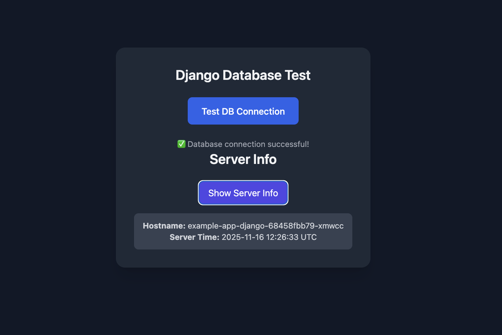
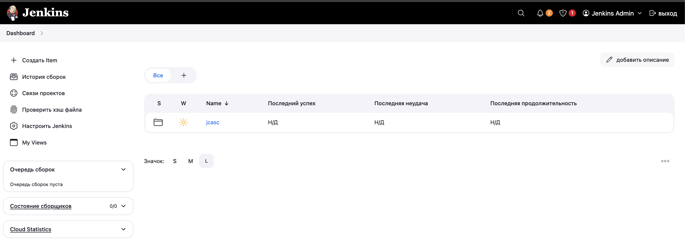
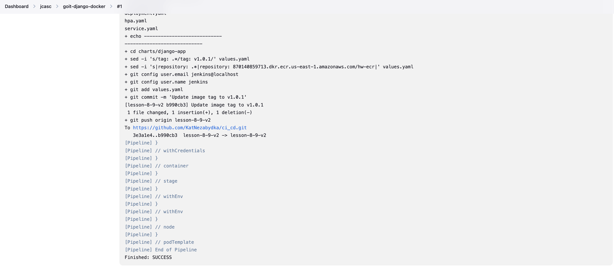
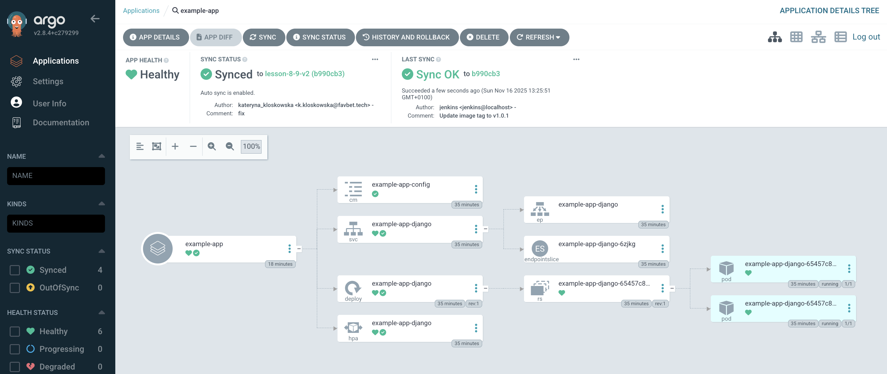

# 🚀 CI/CD for Django on EKS with Jenkins and Argo

This project demonstrates how to deploy a Django application on AWS EKS using Terraform, Docker, ECR, Jenkins and Argo

---

## Terraform Setup (EKS + Node Group)

1. Go to the Terraform directory:

```
cd terraform
```

2. Terraform:

```
terraform init
terraform plan
terraform apply
terraform destroy
```

3. Configure your kubeconfig for access:

```
aws eks --region us-east-1 update-kubeconfig --name eks-cluster-avoo

kubectl get nodes
```

If nodes show Ready, your cluster is ready.

## Build Docker Image and Push to ECR (Mac vertion)

1. Authenticate Docker with AWS ECR:

```
aws ecr get-login-password --region {region} | docker login --username AWS --password-stdin {host}

docker buildx build --platform linux/amd64 -t {host}/hw-ecr:{version} --push .
```

# EKS

For EKS cluster we need to get kubeconfig file

`aws eks --region eu-central-1 update-kubeconfig --name eks-cluster-avoo`

Check if it is working:

`kubectl get nodes`

After this we can comment our providers in main.tf file
and use the local config:

```hcl
provider "kubernetes" {
  config_path = "~/.kube/config"
}

provider "helm" {
  kubernetes = {
    config_path = "~/.kube/config"
  }
}
```

# Jenkins and ArgoCD

Get a password from argo
```
kubectl -n argocd get secret argocd-initial-admin-secret -o jsonpath="{.data.password}" | base64 -d
```

# General
If you need to do some changes
```
helm uninstall jenkins -n jenkins
helm uninstall argo-cd -n argocd
helm uninstall argo-cd-apps -n argocd
```
```
terraform apply
```





